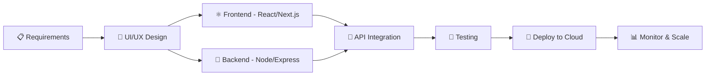

<!-- Header Banner -->
<div align="center">
  
</div>

<!-- Typing SVG -->
<div align="center">
  <a href="https://git.io/typing-svg"></a>
</div>

<br/>

<!-- Profile Views & Followers -->
<div align="center">
  <a href="https://github.com/Tarun25112002"></a>&nbsp;
  <a href="https://github.com/Tarun25112002?tab=followers"></a>&nbsp;
  <a href="https://github.com/Tarun25112002?tab=repositories&sort=stargazers"></a>
</div>

<br/>

<!-- About Me -->


##  About Me

```javascript
const tarun = {
  pronouns: "he" | "him",
  location: "India 🇮🇳",
  role: "Full Stack Web Developer",
  workingAs: "Freelancer",
  currentlyLearning: ["System Design", "DevOps"],
  funFact: "I debug in production... just kidding! 😄",
  lifePhilosophy: "Code. Ship. Repeat. 🚀",
};
```

- 🔭 I'm currently working on **exciting freelance projects**
- 🌱 I'm diving deeper into **System Design & Cloud Architecture**
- 💬 Ask me about **React, Next.js, Node.js, TypeScript, MongoDB**
- 📫 Reach me at **[tarunjha.vercel.app](https://tarunjha.vercel.app)**
- ⚡ Fun fact: **I can center a div on the first try** 😎

<br clear="both"/>

---

<!-- Tech Stack -->

## 🛠️ Tech Arsenal

<div align="center">

### 💻 Frontend

<p>
  
  
  
  
  
  
  
  
  
  
</p>

### ⚙️ Backend

<p>
  
  
  
  
  
  
</p>

### 🗄️ Database

<p>
  
  
  
  
  
</p>

### 🚀 DevOps & Tools

<p>
  
  
  
  
  
  
  
  
  
</p>

</div>

---

<!-- GitHub Stats -->

##  GitHub Analytics

<div align="center">
  
  
</div>

<br/>

<div align="center">
  
</div>

<br/>

<!-- Activity Graph -->
<div align="center">
  
</div>

---

<!-- What I Do -->

## 🎯 What I Bring to the Table

<div align="center">
<table>
<tr>
<td align="center" width="33%">

<br/><b>Frontend Development</b>
<br/><sub>Crafting pixel-perfect, responsive UIs with React, Next.js & modern CSS frameworks</sub>
</td>
<td align="center" width="33%">

<br/><b>Backend Development</b>
<br/><sub>Building robust APIs & server-side logic with Node.js, Express & databases</sub>
</td>
<td align="center" width="33%">

<br/><b>Full Stack Solutions</b>
<br/><sub>End-to-end development from design to deployment with modern tech stack</sub>
</td>
</tr>
</table>
</div>

---

<!-- Featured Projects -->

## 🏆 Featured Projects

<div align="center">

<a href="https://github.com/Tarun25112002?tab=repositories">
  
</a>

> 💡 _Pin your best repositories to showcase them here!_

</div>

---

<!-- Work Process -->

## ⚡ My Development Workflow

```
📋 Plan    →    🎨 Design    →    💻 Develop    →    🧪 Test    →    🚀 Deploy
```



---

<!-- Connect With Me -->

## 🤝 Let's Connect & Collaborate

<div align="center">
  <a href="https://www.linkedin.com/in/tarun-kumar-jha-721761248/">
    
  </a>&nbsp;
  <a href="https://x.com/TarunJha2002">
    
  </a>&nbsp;
  <a href="https://tarunjha.vercel.app">
    
  </a>&nbsp;
  <a href="mailto:tarunjha2002@gmail.com">
    
  </a>
</div>

<br/>

<div align="center">
  
</div>

---

<!-- Snake Animation -->
<div align="center">
  <picture>
    <source media="(prefers-color-scheme: dark)" srcset="https://raw.githubusercontent.com/Tarun25112002/Tarun25112002/output/github-snake-dark.svg" />
    <source media="(prefers-color-scheme: light)" srcset="https://raw.githubusercontent.com/Tarun25112002/Tarun25112002/output/github-snake.svg" />
    
  </picture>
</div>

---

<!-- Trophy -->
<div align="center">
  
</div>

---

<!-- Support -->
<div align="center">
  
  ### 💜 If you like my work, consider giving a ⭐ to my repositories!
  
  <br/>
  
  
</div>
